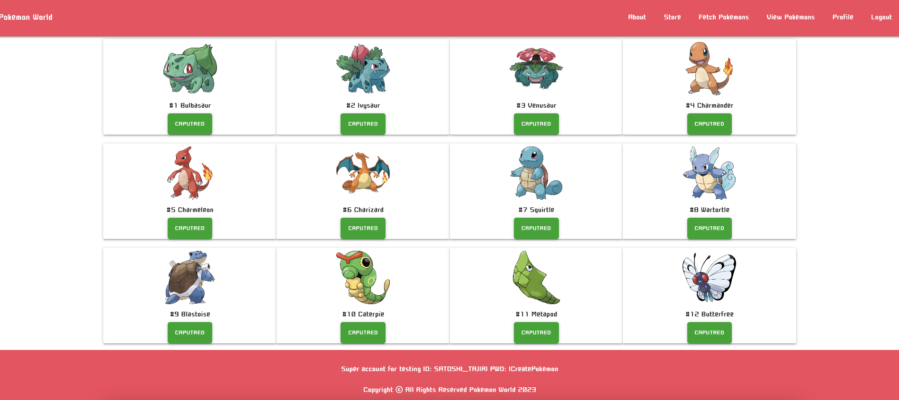
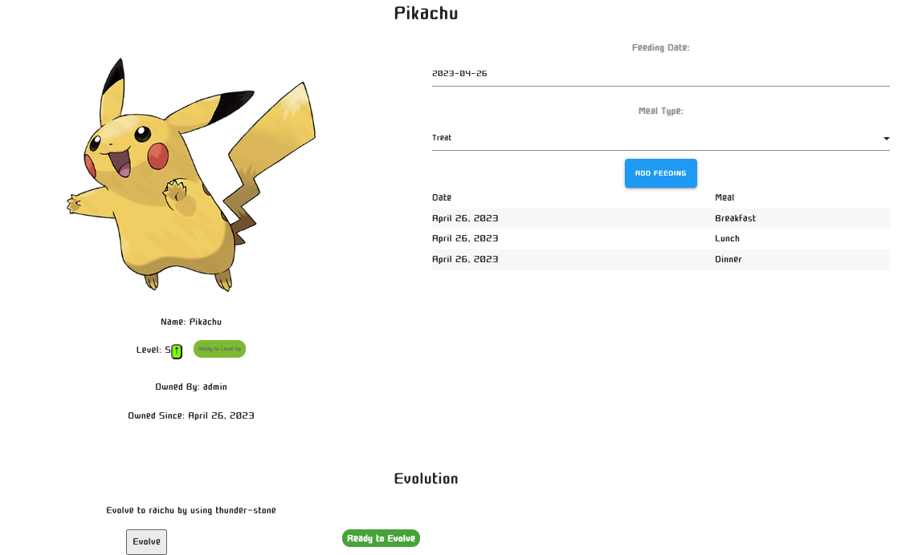

# Pokemon World

This project aims to build up a APP that user can do the followings:
- Non-registered users can browse through the store and view Pokemons without logging in.
- Registered users can sign up to create their player profile and access additional features.
- Once registered, users can view Pokemons and capture them to either their pockets or boxes.
- They can also check the details of each Pokemon and feed them meals.
- If the Pokemons are satisfied with their feedings, they will level up.
Users can move Pokemons in and out of their pockets and boxes, as well as release them.
- Moreover, users can purchase items from the store and use them to drive their Pokemons to evolve. 
# Technologies Used

Used: HTML, CSS, JavaScript, Django, Heroku, Materialize, Google Fonts

# Screenshots

# Getting Started:

[Click here](https://pokemonworld.herokuapp.com/) to see the deployed app!

# Future Enhancements:
- Improved capturing of Pokemons using pokemon balls, with a chance of failure.
- More comprehensive evolution feature that supports a wider range of Pokemons using stones and level up. 
- Enhanced Pokemon gym battles with additional Pokemon stats and battle logic.
